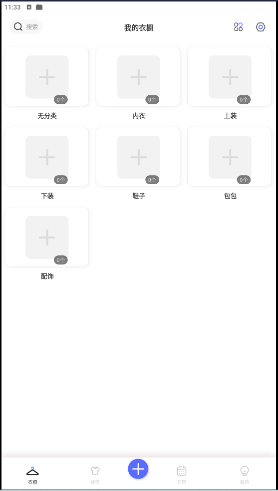
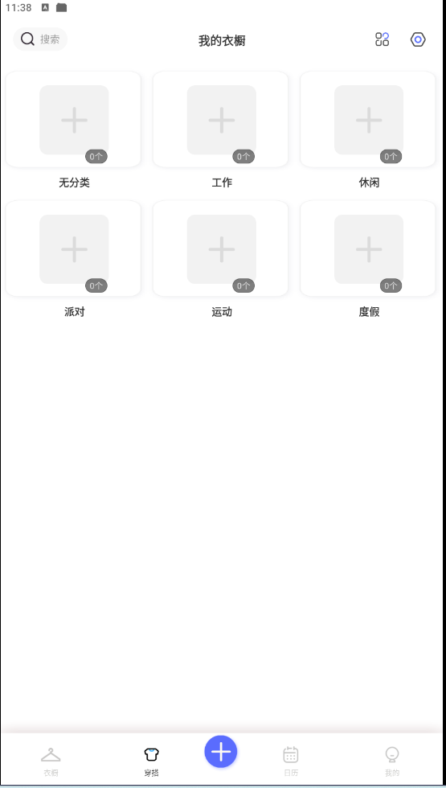
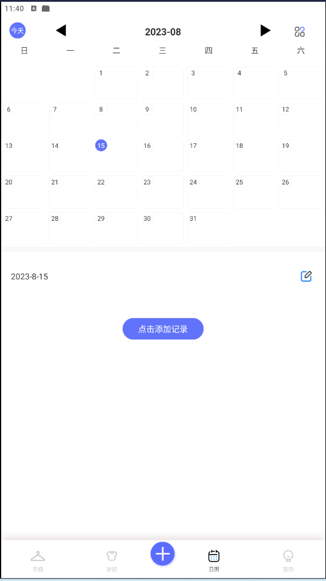
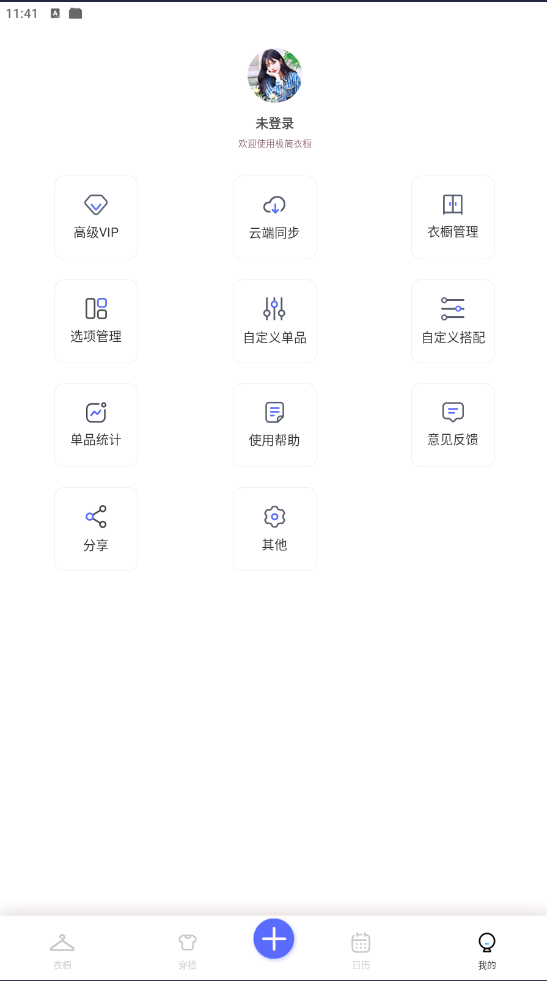
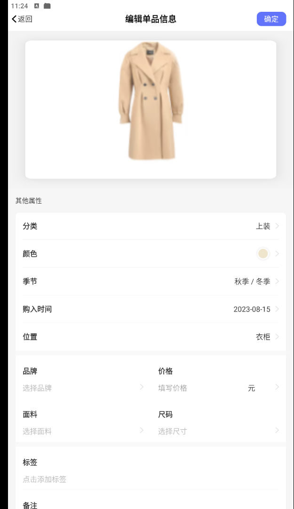
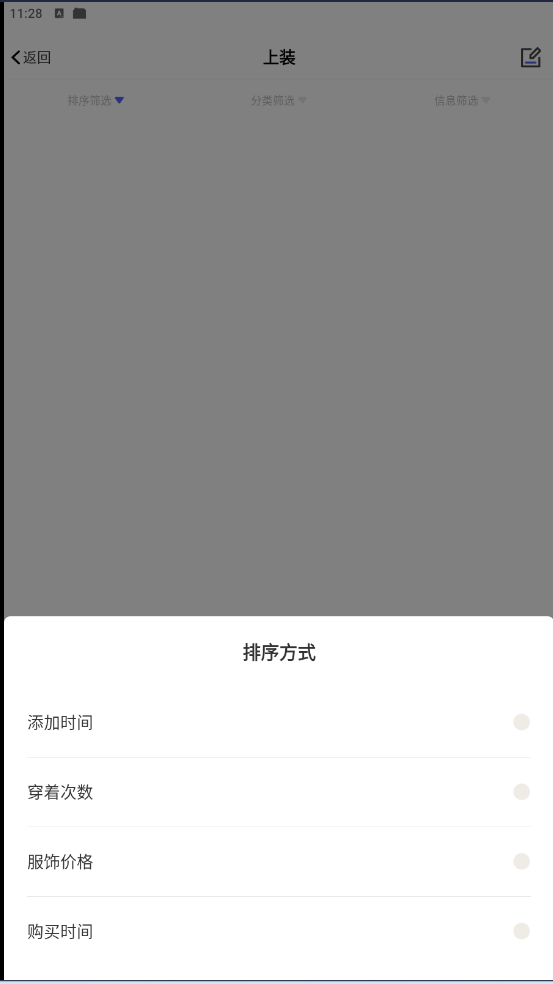
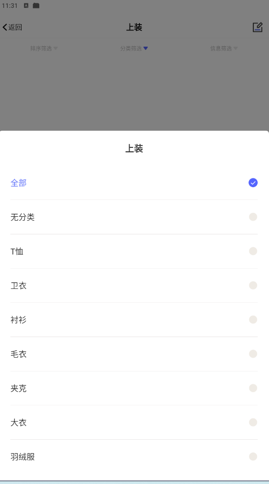
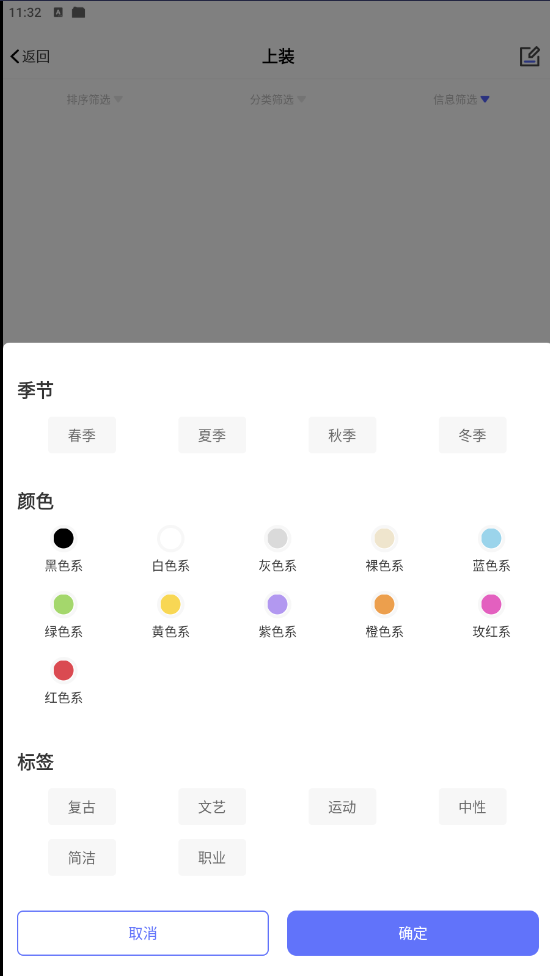
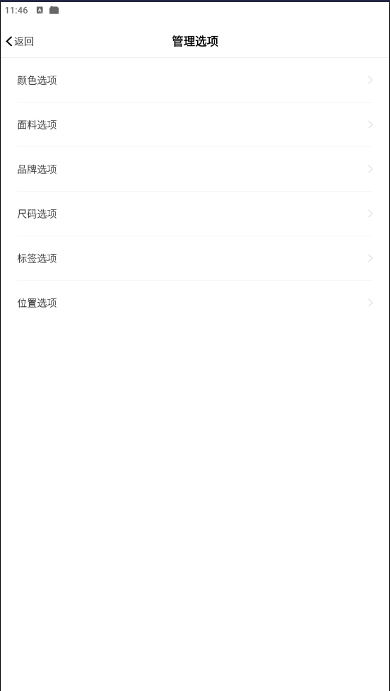

# 极简衣橱体验

极简衣橱体验， 界面截图：

* 界面-首页
  * 标题
  * 全局搜索
  * 功能展示区
  * 下标栏
    * 衣橱
    
    * 穿搭
    
    * 日历
    
    * 我的
    
    

* 界面-编辑单品信息
   * 物品图片
   * 其它属性
     * 分类
     * 颜色-色系
     * 季节（春夏秋冬-下拉选择-支持多选）
     * 购入时间
     * 位置（衣柜、鞋柜， 可以自定义增加位置）
     * 品牌
     * 价格
     * 面料
     * 尺寸
     * 标签
     * 备注

     

