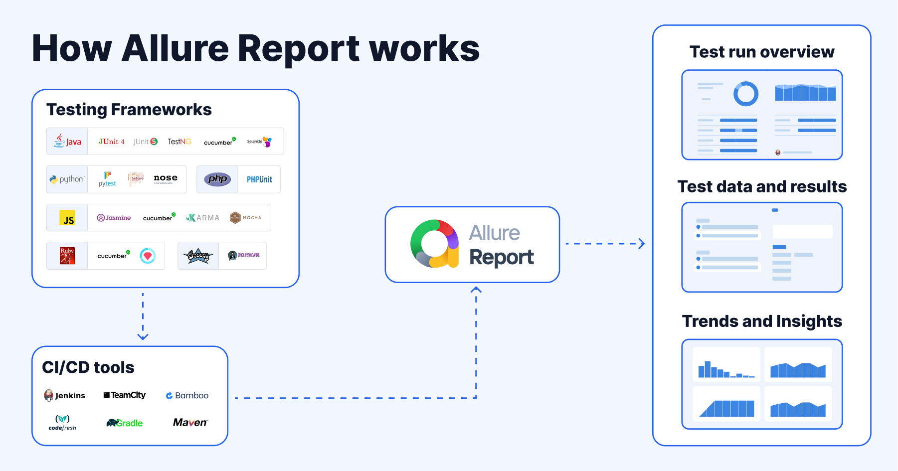

# CI System

allure报告是怎么工作的？

CI System or CI/CD tools:

| CI System |
|-----------|
| Jenkins   |
| Bamboo    |
| GitLab    |
| GitLab    |
| CircleCI  |
| TeamCity  |
| codefresh |
| Maven     |
| TeamCity  |
| Gradle    |

Testing Frameworks:

| Java     | Python | JavaScript | Ruby |
|----------|--------|------------|------|
| jUnit-4  | Pytest | Jasmine    | cucumber|
| jUnit-5  | nose   | cucumber   |      |
| TestNG   |        | ARMA       |      |
| cucumber |        | MOCHA      |      |
|          |        |            |      |
|          |        |            |      |

Report:

| Report |
|--------|
| allure |

Result:

| 结果                    |
|-----------------------|
| Test run overview     |
| Test data and results |
| Trends and Insights   |
