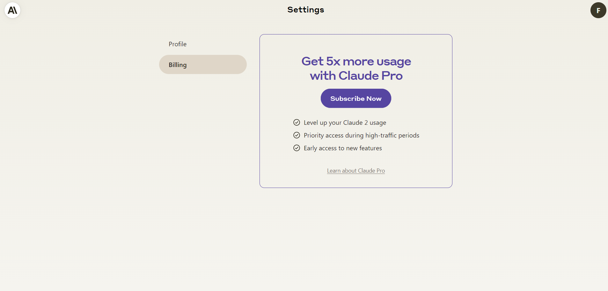
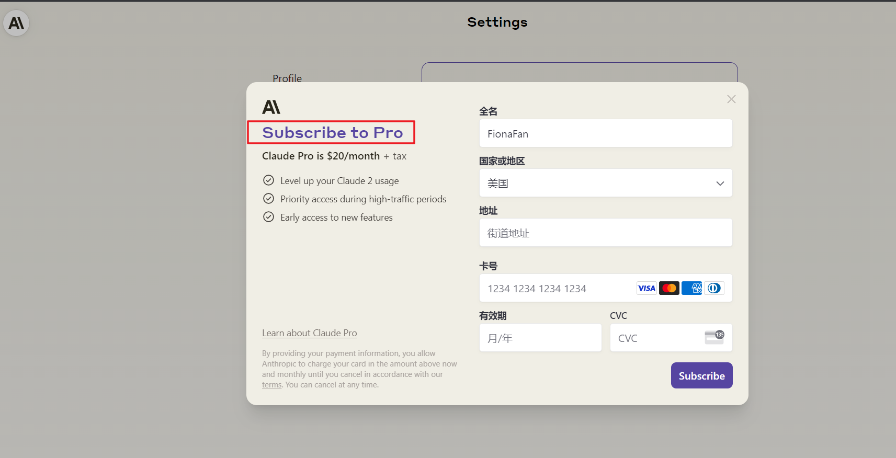

chatgpt： https://mp.weixin.qq.com/s?__biz=MzA3MTg1OTM3MQ==&mid=2649978976&idx=5&sn=d25c833f4710b8375a05366c89d75202&chksm=8720f5a4b0577cb2c772d9d1fe91de991cbf09350f5264a8d6a3b9093a2223262c89b6cfd226&scene=27
Anthropic claude： https://zhuanlan.zhihu.com/p/630462342?utm_id=0 (这个链接的方法不适用了)

chatgpt:

    登录首页：https://chat.openai.com
    
    注册 ChatGPT： 用的qq邮箱 134@qq.com； fiona123@F&Fiona@1-3
    要注册使用 ChatGPT，我们需要准备以下内容：
    
    vpn： 能够访问Google的全局代理，推荐美国节点；
    
    一个邮箱用于注册，如Gmail, Outlook ；  我用的是：qq邮箱
    
    一个国外手机号，如果没有可以使用https://sms-activate.org ：
    买的手机号， 充值1美元，7.4人民币， 74卢布，买了一个英格兰的手机号用来接收短信：xxxxx
    
    fxxanjing@163.com/R@SmsFiona@1-3

Anthropic：

    https://www.anthropic.com/
    https://claude.ai/onboarding?returnTo=%2F
    需要：
    1. 邮箱
    2. 能够接收短信验证码的手机号 +44 (749)4681319  20分钟过期。 英格兰 10卢布； 只需要第一次手机验证码验证确认即可。 
    用的qq邮箱 134@qq.com； 没有让我设置密码�G, 后续通过邮箱发送验证码登录。
    name: FionaFan
    3. 账号登录后，可以在页面上向chatgpt一样 输入问题， claude给出回答。
    4. 要想体验claude 2 模型， 得升级， 升级需要$20/month ;  还需要银行卡（支持：visa， 银联）， china地区不支持使用。
    5. 但是还没有找到Anthropic_API_KEY的获取方式，还不能使用API

