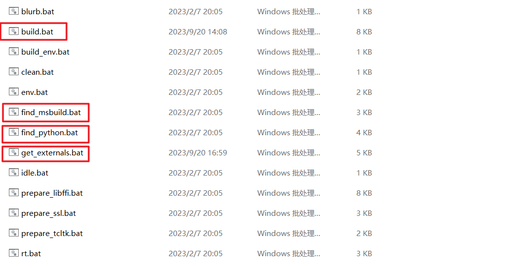
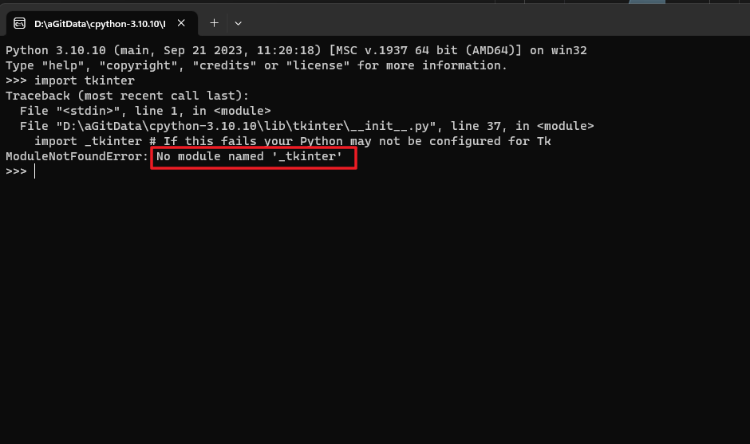

# cpython源码解读

## 获取cpython源码
* git clone https://github.com/python/cpython
* github选择指定python版本下载.zip文件到本地进行解压, 如： https://github.com/python/cpython/tree/v3.10.10

## cpython源码结构

```text
cpython/
│
├── Doc ← 源代码文档说明
├── Grammar ← 计算机可读的语言定义
├── Include ← C 语言头文件（头文件中一般放一些重复使用的代码）
├── Lib ← Python 写的标准库文件
├── Mac ← Mac 支持的文件
├── Misc ← 杂项
├── Modules ← C 写的标准库文件
├── Objects ← 核心类型和对象模块
├── Parser ← Python 解析器源码
├── PC ← Windows 编译支持的文件
├── PCbuild ← 老版本的 Windows 系统 编译支持的文件
├── Programs ← Python 可执行文件和其他二进制文件的源代码
├── Python ← CPython 解析器源码
└── Tools ← 用于构建或扩展 Python 的独立工具
```

标准库: Lib + Modules
python解释器本身:Python + Parser + Objects + Includes
文档相关： Doc + Grammar
平台编译工具相关: Mac + Misc + PC + PCbuild + programes + Tools 


* Parser：  将python源码 解析为 ast抽象语法树
  * 词法分析器 tokenizer (词法分析器负责将源代码分解为一系列词法单元（tokens），包括标识符、关键字、运算符、常量等。词法分析器的实现可以在 Parser/tokenizer.c 文件中找到。这些 tokens 会被传递给语法分析器以构建语法树。)
  * 语法分析器 parser (语法分析器（parser）接受词法分析器生成的 tokens，并将它们组织成语法树（AST）。Python 解释器的语法分析器的实现代码位于 Parser/parser.c 文件中。语法分析器使用 Python 语法规则（定义在 Grammar/Grammar 文件中）来确定代码的结构。)
  * 定义和操作抽象语法树的代码 AST (语法分析器会生成抽象语法树（AST），它是代码的抽象表示，用于表示代码的结构和语义。AST 的节点代表不同的语法结构，例如函数调用、赋值、条件语句等。AST 通常被用于代码分析、优化和执行。Python 解释器通过调用语法分析器和 AST 构建函数来将源代码解析为 AST。一旦 AST 构建完成，解释器可以对 AST 进行进一步的处理和执行。)

* 认识cpython的源码结构 （ok）
* 成功编译cpython的源码 （windows、linux、mac  一个都没有试过）
* 为Python写c扩展

-----
PCbuild中的bat脚本：



编译说明，源码中的文档说明：
* cpython-3.10.10/PCbuild/readme.txt 
* cpython-3.10.10/Tools/msi/README.txt


编译入口，源码中的编译路口：
* cpython-3.10.10/PCbuild/build.bat (在win11系统编译成功， 且可以正常用pycharm加载使用)
* cpython-3.10.10/Tools/msi/build.bat
* cpython-3.10.10/Tools/msi/buildrelease.bat


编译cpython根据官网指导文档及chatgpt提示，
1.执行 PCbuild中的build.bat脚本文件 (但在这个过程中有报错， 经过查看日志，得知，是获取externals依赖文件报错，导致后面编译报错，
在这个过程中， 发现执行build.bat脚本 获取externals文件，其实是依赖于get_externals.bat，和 get_external.py文件)
(bat脚本能力)
build.bat(脚本内的标签节点):
1. :Usage
2. :Run
3. :CheckOpts
4. :Kill
5. :Build
6. :Regen
7. :Build
8. :Version

build.bat(执行顺序):
goto Run
goto :Build
找到msbuild.


1. build.bat --> get_externals.bat --> externals
2. build.bat --> find_msbuild.bat -- > MSBUILD
3. build.bat --> find_python.bat --> PYTHON
4. get_externals.bat --> get_external.py （可以单独调用， 下载依赖库时，网络过慢会报网络连接错误， 我倒是没有修改东西， 只是多尝试了好多次，才把需要的包都下下来了）
5. get_external.py --> org --> find_python.bat

问题：
没有编译tkinter, 就无法使用tkinter模块


-----
参考的评论建议：
* cpy的源码，还是有点复杂的，其实发展较为成熟的语言的源码都比较复杂，不是说难度有多高，是内容多且模块间可能有些耦合，或有些trick，初学者的话可以找一些简单的DSL实现先看看，最好做一些编译原理实践，这样看起来效率会更高些
* chatgpt问答 + 实践

参考资料：
1. https://github.com/shishujuan/python-source-code-analysis(这个作者解析的python版本2.5.6：原文中写到：陈儒大神分析的那个版本一致，版本是2.5.6.源码官网有下载)
2. https://github.com/hitlic/python_book （python的基础教学课程）
3. https://www.bilibili.com/video/BV1sS4y1g7hN/?spm_id_from=333.337.search-card.all.click&vd_source=9ab8a945335cbaf24c13e51eba88b195 (b站博主， Cpyhon和Cython的区别？)
4. https://www.zhihu.com/tardis/bd/art/210849122?source_id=1001 （第一个Cython程序）
5. https://www.applenice.net/2020/06/21/Build-CPython-on-Windows/ （编译cpython参考文章， 已实践过， 到了pcbuild.sln和vstudio后面有用到）
6. https://www.cnblogs.com/np10/p/5185477.html (虽然这篇文将的2.x版本的cpython编译，但还是有可以借鉴的地方， pcbuild.sln编译时， 可以看情况，删除掉不需要的库，这样编译成功后，删掉的库就不需要了)
7. https://blog.csdn.net/deflypig/article/details/121448926 (MSBuild解释 csdn博主)