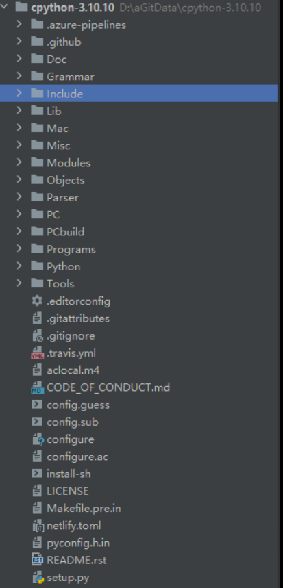

# cpython源码解读

## 获取cpython源码
* git clone https://github.com/python/cpython
* github选择指定python版本下载.zip文件到本地进行解压, 如： https://github.com/python/cpython/tree/v3.10.10

## cpython源码结构

```text
cpython/
│
├── Doc ← 源代码文档说明
├── Grammar ← 计算机可读的语言定义
├── Include ← C 语言头文件（头文件中一般放一些重复使用的代码）
├── Lib ← Python 写的标准库文件
├── Mac ← Mac 支持的文件
├── Misc ← 杂项
├── Modules ← C 写的标准库文件
├── Objects ← 核心类型和对象模块
├── Parser ← Python 解析器源码
├── PC ← Windows 编译支持的文件
├── PCbuild ← 老版本的 Windows 系统 编译支持的文件
├── Programs ← Python 可执行文件和其他二进制文件的源代码
├── Python ← CPython 解析器源码
└── Tools ← 用于构建或扩展 Python 的独立工具
```


参考资料：
1. https://github.com/shishujuan/python-source-code-analysis(这个作者解析的python版本2.5.6：原文中写到：陈儒大神分析的那个版本一致，版本是2.5.6.源码官网有下载)
2. https://github.com/hitlic/python_book （python的基础教学课程）