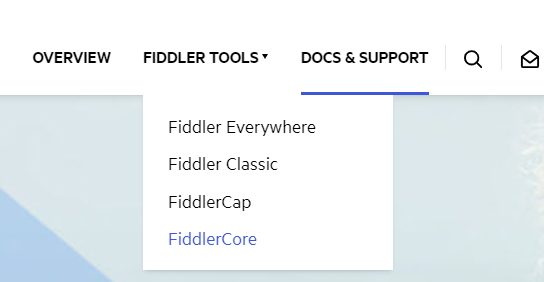
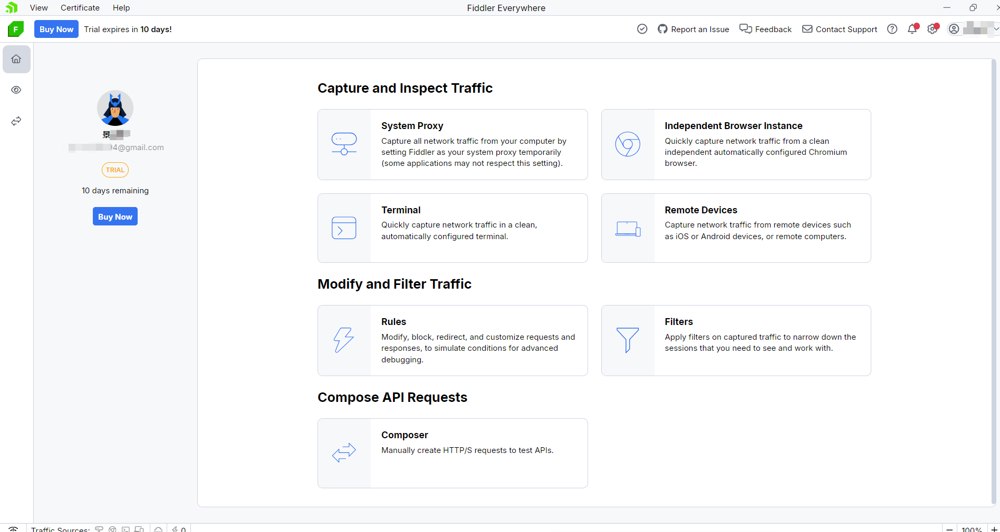
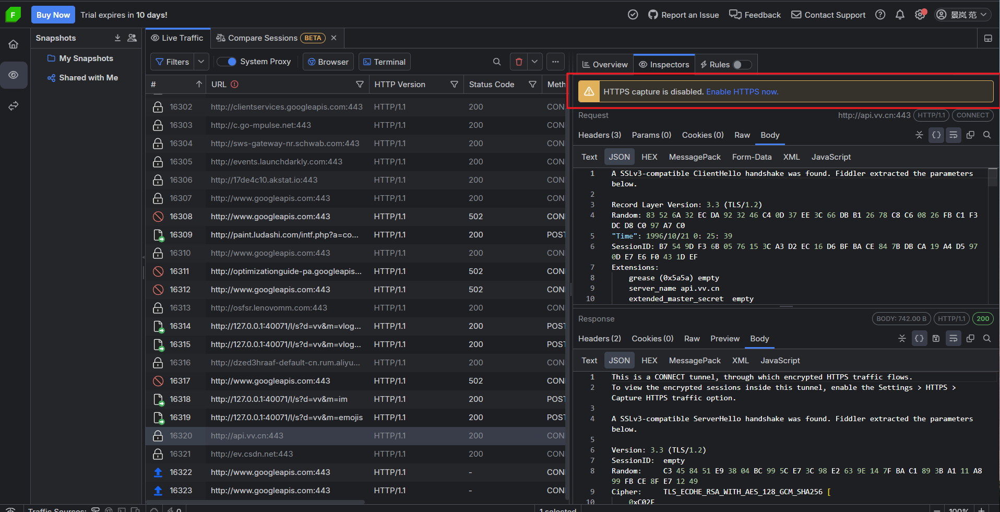
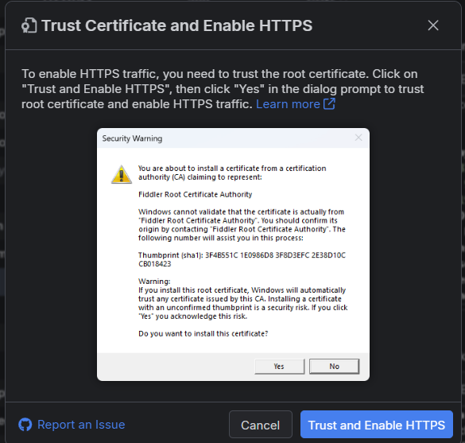
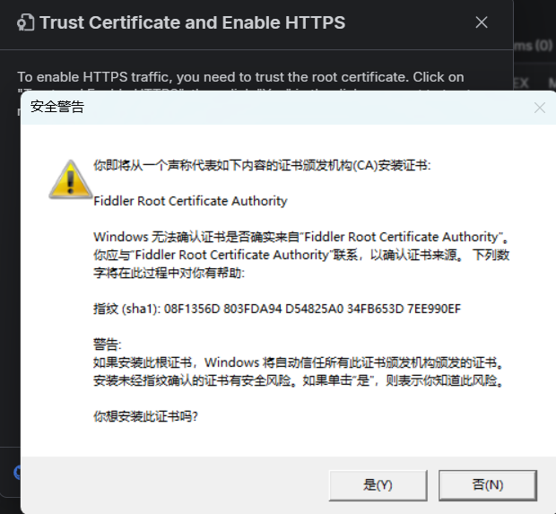

# 抓包
1. Wireshark： https://www.wireshark.org/
2. Fiddler：https://www.telerik.com/download/fiddler
3. Charles: https://www.charlesproxy.com   (Charles 工具是不免费的。它需要购买 license，如果不购买使用的话就会每 30 分钟断一次，使用体验非常不好！)

3. Tcpdump： https://www.tcpdump.org/
4. Solarwinds带宽分析器：https://www.solarwinds.com/network-bandwidth-analyzer-pack/registration?program=856&c=70150000000PahF&CMP=BIZ-TAD-NMS-BW_MON_DOWNLOADS-NBAP-DL-HMPG
5. Free Network Analyzer：https://freenetworkanalyzer.com/
6. NAST：https://sourceforge.net/projects/nast.berlios/
7. Kismet : https://www.kismetwireless.net/
8. EtherApe: https://etherape.sourceforge.io/
9. NetworkMiner:https://www.netresec.com/?page=Networkminer
10. WinDump: https://www.winpcap.org/windump/

抓包工具多又强大，每个工具都有各自的适用场景。
* 抓windows上的http请求，推荐用浏览器自带的http抓包工具
* 抓windows上的tcp包，推荐用Wireshark
* 抓手机上上的http包，推荐用Fiddler

每个工具的使用教程参考官方文档

# 使用
## charles使用：

1. C:\Users\fxxji>adb root push C:\Users\fxxji\Desktop\Desktop.p12 /data/misc/user/0/cacerts-added/Desktop.p12
    restarting adbd as root

2. C:\Users\fxxji>adb push C:\Users\fxxji\Desktop\Desktop.p12 /data/misc/user/0/cacerts-added/Desktop.p12
   C:\Users\fxxji\Desktop\Desktop.p12: 1 file pushed, 0 skipped. 2.5 MB/s (3194 bytes in 0.001s)
3.  mv Desktop.p12 /system/etc/security/cacerts/Desktop.p12

1|:/data/misc/user/0/cacerts-added # exit
1|marlin:/data/misc/user/0/cacerts-added # exit

C:\Users\fxxji>adb root
adbd is already running as root

C:\Users\fxxji>adb remount
remount succeeded

C:\Users\fxxji>adb shello
adb.exe: unknown command shello

C:\Users\fxxji>adb shell
marlin:/ # ls /data/misc/user/0/cacerts-added
Desktop.p12
marlin:/ # mv ^C
130|marlin:/ # mv /data/misc/user/0/cacerts-added/Desktop.p12 /system/etc/security/cacerts/  (成功)

charles注册账号：https://www.zzzmode.com/mytools/charles/ (有用)
fiona
1a75257665ebefcae4

## fiddler使用

官方提示： 请注意，Fiddler Classic并未处于积极开发状态，也未提供任何发布、补丁或技术支持的承诺。使用本产品，您将承担所有相关风险。我们建议升级到Fiddler Everywhere。

* Fiddler Everywhere
* Fiddler Classic
* FiddlerCap
* FiddlerCore 
这四个东西的区别是什么？
Fiddler Everywhere是一个现代的，易于使用的web调试代理，适用于macOS, Windows和Linux。用于测试端到端行为的可信调试工具。
Fiddler Everywhere是一个强大的工具，可以在响应到达浏览器之前修改响应，以测试和调试web应用程序。你的必备工具。
Fiddler Everywhere灵活的定价计划提供您期望的高价值。无论您选择哪种计划，您的订阅都是功能丰富的。买之前先试一下。
Fiddler Everywhere为web、移动和桌面调试提供了一种直接的方法，产生了measuab

与Fiddler Everywhere相比，?其他版本的Fiddler（?如Fiddler Classic）?可能功能上有所差异，?且可能仅限于特定的操作系统使用。?
例如，?Fiddler Classic主要是为Windows系统设计的，?而Fiddler Everywhere则扩展到了跨平台的支持，
?使得更多用户可以受益于这一工具的强大功能。?

### fiddler everywhere installed

总结：
fiddler everywhere用在抓包网页端的网站倒是很好用， 和网页端的f12一样，
http不需要任何配置， https协议的请求得需要安装证书才可以抓到。 
用在app端就需要在手机端或者模拟器中多配置一下证书。只有证书配置好了， 才可以抓到手机端的包。 

# 参考链接

*  10个抓包工具：https://cloud.tencent.com/developer/article/2230780
*  抓包原理： https://zhuanlan.zhihu.com/p/454356245
*  charles+雷电模拟器抓包：https://blog.csdn.net/qq_45444679/article/details/135677033
*  charles使用教程： https://zhuanlan.zhihu.com/p/562928102
*  charles注册教程： https://www.zzzmode.com/mytools/charles/
*  手机端死活抓不到包： https://zhuanlan.zhihu.com/p/352767166