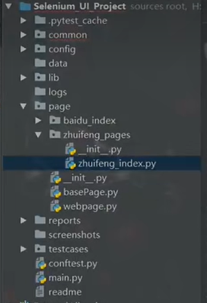

# 说明记录



## pytest简介：
pytest是python的单元测试框架， 是第三方的，需要额外安装。

pytest有很多非常强大的插件， 并且这些插件能够实现很多实用的操作：
- pytest
- pytest-html 【生成html格式的自动化测试报告】
- pytest-xdist 【测试用例分布式执行， 多cpu分发】
- pytest-ordering 【用于改变测试用例的执行顺序】
- pytest-rerunfailures 【用例失败后重跑】
- allure-pytest 【用于生产美观的测试报告】

放到 pytest_requirements.txt， 通过pip install -r pytest_requirements.txt -i https://pypi.douban.com/simple/
如果是在python==3.6环境下安装完后， 执行pip list如下:
```
Package               Version
--------------------- ---------
allure-pytest         2.13.2
allure-python-commons 2.13.2
atomicwrites          1.4.1
attrs                 22.2.0
certifi               2021.5.30
colorama              0.4.5
execnet               1.9.0
importlib-metadata    4.8.3
iniconfig             1.1.1
packaging             21.3
pip                   21.2.2
pluggy                1.0.0
py                    1.11.0
pyparsing             3.1.0
pytest                7.0.1
pytest-html           3.2.0
pytest-metadata       1.11.0
pytest-ordering       0.6
pytest-rerunfailures  10.3
pytest-xdist          3.0.2
setuptools            58.0.4
tomli                 1.2.3
typing_extensions     4.1.1
wheel                 0.37.1
wincertstore          0.2
zipp                  3.6.0
```
py37环境和py36一致:


## pytest 使用
### 使用pytest， 默认的测试用理的规则及基础应用
- 【模块名】必须以test_开头或者 _test结尾
- 【测试类】必须以Test开头， 并且不能有init方法
- 【测试方法】必须以test开头

### pytest测试用例的运行方式
- 主函数模式
  - 运行所有模块: pytest.main()
  - 运行指定模块：pytest.main(['-vs', 'test_login.py'])
  - 运行指定目录： pytest.main(['-vs', './interface_testcase'])
  - 通过nodeid指定用例运行： nodeid由模块名，分隔符，类名， 方法名， 函数名组成：
    - pytest.main(['-vs', './interface_testcase/test_interface.py::test_interface_01_func'])
    - pytest.main(['-vs', './interface_testcase/test_interface.py::TestInterface::test_01_interface'])
    
- 命令行模式
  - 运行所有模块: pytest
  - 运行指定模块: pytest -vs  test_login.py
  - 运行指定目录:  省略，举一反三
  - 通过nodeid指定用例运行：省略，举一反三
- 通过读取pytest.ini配置文件运行(项目中大多是是使用这种模式)
  pytest.ini这个文件它是pytest单元测试框架的核心配置文件
  - 位置： 一般放在项目的根目录
  - 编码：必须是ANSI编码格式
  - 作用：改变pytest默认的行为
  - 运行的规则：  不管是主函数的模式运行， 命令行模式运行， 都会去读取这个配置。
```ini
[pytest]
addopts = -vs  # 命令行的参数
testpaths = ./testcase  # 测试用例的路径
python_files = aaa_*.py  # 模块名的规则
python_classes = Test*   # 类名的规则
python_functions = aaa   # 方法名的规则
```
参数详解：
   -v：显示更详细的信息 
   -s：表示输出调试信息， 包括print打印的信息
   -vs: 这两个参数可以一起用
   -n: 支持多线程或者分布式运行测试用例， -n 2 表示以2个线程跑
   -reruns 2： 表示失败用例重跑2次
   -x： 表示只要一个用例报错，那么测试停止
   -maxfail=2: 出现两个用例失败，就停止
   -k： 根据测试用例的部分字符串指定测试用例，如： pytest -vs ./testcase -k 'ao'

执行示例图片：


### pytest执行测试用例的顺序
unitest: ascll的大小来决定执行的顺序
pytest：默认从上到下
改变默认的执行顺序： 使用mark标记。
`@pytest.mark.run(order=3)`

### 如何分组执行（冒烟、分模块执行、分接口和web执行）
```python
# @pytest.mark.smoke
```
smoke: 冒烟用例， 分布在各个模块里面
pytest -m "smoke"
pytest- m "smoke or usermanage or productmanage"

### pytest 跳过执行
```python
# 有条件跳过： @pytest.mark.skipif(age>=18, reason="已成年")
# 无条件跳过：@pytest.mark.skip(reason="username不正确")
```

### pytest根据allure生成报告
- 安装allure包， 到https://github.com/allure-framework/allure2/releases下载安装，配置好环境变量
或者windows系统通过下载安装scoop后， 再安装allure， 省去了自己手动配置环境变量的步骤。
- 依赖jdk，下载地址： https://www.oracle.com/java/technologies/downloads/
jdk安装方式： https://www.liaoxuefeng.com/wiki/1252599548343744/1280507291631649
- 重启pychrm：期间，需要重启pycharm才能生效。
- 执行命令
    - 生成临时的json文件报告： --alluredir ./temp
    - 通过临时的json文件生成allure报告: os.system("allure generate temp -o reports  --clean")
- allure 报告的定制： 比如可以修改报告上的一些logo啊， 把默认的改成自己的logo 
allure官网： http://allure.qatools.ru/
```json 
@allure.epic('淘宝')      # 工程级别
@allure.feature('设置')   # 模块级别，一级标签
@allure.story('账户安全')  # 模块级别，二级标签
@allure.title('用例标题：test_001')  # 三级标签
```


### 前后置 
- setup/teardown, setup_class/teardown_class： 作用于所有用例或者所有的类
- @pytest.fixture(scope="class", params=["aa", "bb"], autouse=True): 既可以部分也可以全部前后置
- conftest.py和@pytest.fixture()结合使用， 作用于全局的前后置。
   - conftest.py文件是单独存放一个夹具配置文件， 名称是不能更改的
    - 用处： 可以正赛不同的py文件中使用同一个fixture函数
    - 原则上conftest.py需要和运行的用例放到同一层， 且不需要做任何import操作。（可以设计全局的conftest.py和模块级别的conftest.py）
    
### pytest断言
assert 1== 2  # 结果报错

### parametrize 参数化
参数化可以组装测试数据， 在测试前定义好测试数据， 并在测试用例中使用
单次循环： @pytest.mark.parametrize("a", ["b"])
多次循环: @pytest.mark.parametrize("a, b", [("c", "d"), ("e", "f)])
### yaml配置文件读取
data.yaml

pip install pyyaml 
